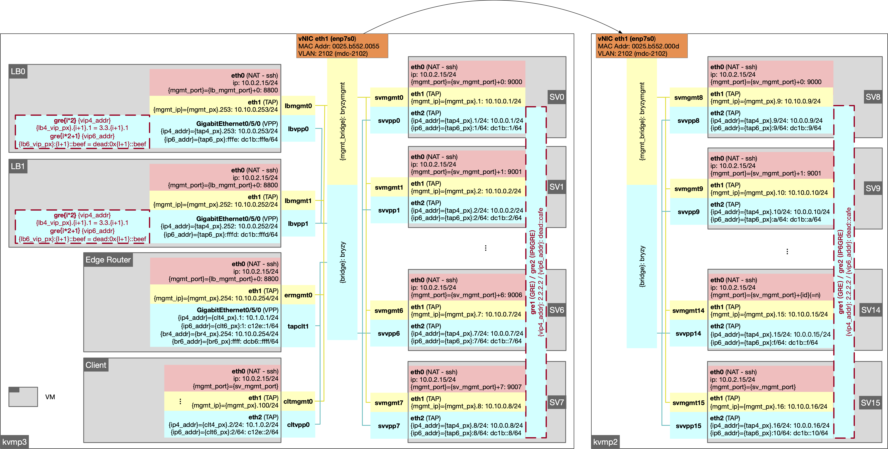

# Aquarius

> Aquarius - Enabling Fast, Scalable, Data-Driven Virtual Network Functions
> 
> **NOTE**: We are currently going through the open-source process required by our institution. The content will soon be available.


## Introduction

This repository implements a data-collection and data-exploitation mechanism Aquarius as a load balancer plugin in VPP. 
For the sake of reproducibility, software and data artifacts for performance evaluation are maintained in this repository.

## Directory Roadmap

```
- config                    // configuration files in json format        
- sc-author-kit-log         // artifacts description of testbed hardware, required by sc21 committee
- src                       // source code
    + client/server         // scripts that run on client/server VMs
    + lb                    // scripts that run on lb VMs
        * dev               // dev version (for offline feature collection)
        * deploy            // deploy version (for online policy evaluation)
    + utils                 // utility scripts that help to run the testbed
    + vpp                   // vpp plugin
        * dev               // dev version (for offline feature collection)
        * deploy            // deploy version (for online policy evaluation)
    + test                  // unit test codes
- data                      
    + trace                 // network traces replayed on the testbed
    + results (omitted)     // This is where all the datasets are dumped (will be automatically created once we run experiments)
    + img                   // VM image files (omitted here because of file size, server configurations are documented in README)
    + vpp_deb               // stores deb files for installing VPP on VMs
        * dev               // dev version (for offline feature collection)
        * deploy            // deploy version (for online policy evaluation)
```

## Get Started

### Pre-Configuration

Run `python3 setup.py`, which does the following things:
- update the root directory in `config/global_config.json` to the directory of the cloned `aquarius` repository (replace the `/home/yzy/aquarius`);
- clone the VPP repository in `src/vpp/base`;
- update the `physical_server_ip` in `config/global_config.json` to the IP addresses of the actual server IP addresses in use;
- update the `vlan_if` as the last network interface on the local machine
- update the `physical_server_ip` in `config/cluster/unittest-1.json` to the local hostname

### VM images

To prepare a VM original image, refer to the README file in `data`. To run all the experiments without issues, create a ssh-key on the host servers and copy the public key to the VMs so that commands can be executed from the host using `ssh -t -t`.

### Run example

A simple example is created using a small network topology (1 client, 1 edge router, 1 load balancer, and 4 application servers) on a single machine. 
Simply follow the jupyter notebook in `notebook/unittest`. 
Make sure the configurations are well adapted to your own host machine. Also make sure that the host machine has at least **20** CPUs. 
Otherwise, the configuration can be modified in `config/cluster/unittest-1.json`. 
To reduce the amount of CPUs required, change the number of `vcpu` of each node in the json file.

## Reproducibility

To reproduce the results in Aquarius paper, three notebooks are presented in `notebook/reproduce`. 
The dataset that are generated from the experiments are stored in `data/reproduce`. 
To run these experiments, **4** physical machines with **12** physcial cores (**48** CPUs) each are required. 
MACROs in the notebook should be well adapted. For instance, VLAN should be configured across the actual inerfacesin use. 
An example of network topology is depicted below.



## Notes

Running the scripts, _e.g._ `src/utils/testbed_utils.py`, requires root access.

# Aquarius
Aquarius - Enabling Fast, Scalable, Data-Driven Virtual Network Functions

